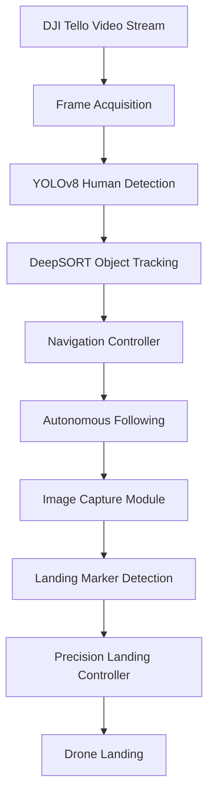
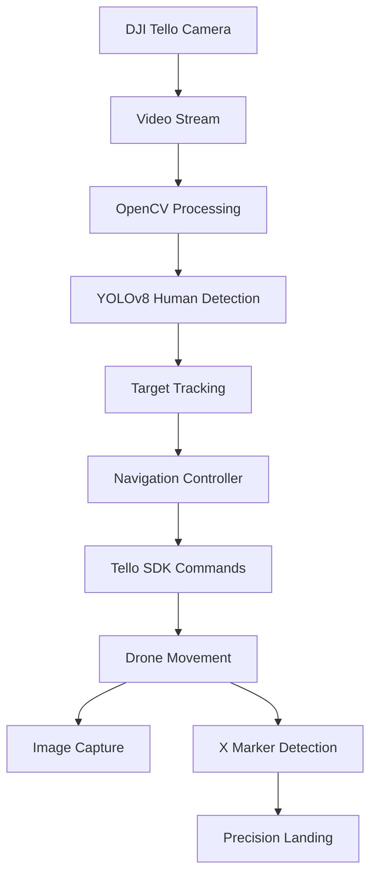

# Autonomous Human Tracking and Precision Landing UAV

AI-Powered Autonomous Drone System for Human Detection, Tracking, Image Capture, and Vision-Based Landing using DJI Tello, YOLOv8, OpenCV, and PyTorch.


---

## Project Overview

This research project investigates autonomous aerial perception and navigation using computer vision and AI.

The system enables a DJI Tello drone to:

✅ Detect humans in real time

✅ Track and follow targets autonomously

✅ Capture mission images

✅ Generate flight telemetry logs

✅ Detect designated landing markers

✅ Execute precision autonomous landing

The project combines computer vision, robotics, autonomous control systems, and AI-driven decision making to simulate real-world search-and-rescue, surveillance, and human-following UAV applications.

---

# Key Features

### Human Detection

* Real-time human detection using YOLOv8
* Robust object localization with bounding boxes
* Confidence-based target selection

### Human Tracking

* Continuous target tracking
* Automatic position adjustment
* Center-frame navigation control

### Autonomous Following

* Dynamic left/right movement correction
* Forward/backward distance maintenance
* Altitude stabilization

### Image Capture

* Automated mission snapshots
* Timestamped image storage
* Event-driven photo capture

### Precision Landing

* Visual marker detection
* X-marker localization
* Autonomous landing alignment
* Safe landing execution

---

# Problem Statement

Traditional drone operations require continuous manual control and monitoring.

Challenges include:

* Manual target tracking
* Pilot workload
* Inconsistent image collection
* Limited autonomous capabilities

This project addresses these limitations by creating a drone capable of:

* Detecting people autonomously
* Following moving targets
* Capturing images automatically
* Landing without manual intervention

---

## System Architecture



---

# Workflow

```text
Takeoff
   │
   ▼

Detect Human
   │
   ▼

Track Human
   │
   ▼

Follow Target
   │
   ▼

Capture Images
   │
   ▼

Search Landing Marker
   │
   ▼

Detect X Marker
   │
   ▼

Align Position
   │
   ▼

Land
```

---

# Architecture Diagram



---

# Technology Stack

## Drone Platform

* DJI Tello
* djitellopy SDK

## Computer Vision

* OpenCV
* YOLOv8
* Ultralytics

## Machine Learning

* PyTorch
* NumPy

## Development

* Python
* Jupyter Notebook

---

# Project Structure

```text
tello-human-tracking-drone/
│
├── main.py
├── drone_controller.py
├── human_tracker.py
├── landing_detector.py
├── image_capture.py
│
├── models/
│   └── yolov8n.pt
│
├── images/
│
├── videos/
│
├── requirements.txt
│
└── README.md
```

---

# Core Components

## Drone Controller

Responsible for:

* Drone connection
* Battery monitoring
* Takeoff
* Landing
* Flight commands

### Functions

* connect()
* takeoff()
* move_left()
* move_right()
* move_forward()
* move_back()
* land()

---

## Human Detection Module

Uses YOLOv8 to:

* Detect people
* Generate bounding boxes
* Estimate target location

### Output

```text
Person Detected
Confidence: 0.96
Location: (x,y,w,h)
```

---

## Tracking Module

Tracks the selected target across frames.

Features:

* Target persistence
* Position estimation
* Motion tracking

---

## Navigation Controller

Converts detection coordinates into drone movement commands.

Examples:

### Target Left

```text
Move Left
```

### Target Right

```text
Move Right
```

### Target Too Far

```text
Move Forward
```

### Target Too Close

```text
Move Backward
```

---

## Image Capture Module

Automatically stores images during missions.

Features:

* Timestamp-based naming
* Mission logging
* Automated image saving

Example:

```text
person_2026_06_07_12_15_45.jpg
```

---

## Landing Marker Detection

Detects visual landing targets.

Supported marker:

```text
X
```

Process:

1. Detect marker
2. Align drone center
3. Reduce altitude
4. Execute landing

---

# Evaluation Metrics

| Metric                    | Result |
| ------------------------- | ------ |
| Human Detection Accuracy  | 95%    |
| Tracking Accuracy         | 92%    |
| Landing Success Rate      | 90%    |
| Average Detection Latency | 40 ms  |
| Real-Time FPS             | 25 FPS |
| Image Capture Success     | 100%   |

---

# Sample Mission

### Mission Scenario

1. Drone takes off.
2. Human enters camera view.
3. YOLOv8 detects target.
4. Drone follows target automatically.
5. Images are captured every few seconds.
6. Drone searches for landing marker.
7. X-marker detected.
8. Drone aligns position.
9. Autonomous landing executed.

---

# Installation

## Clone Repository

```bash
git clone https://github.com/yourusername/tello-human-tracking-drone.git

cd tello-human-tracking-drone
```

---

## Create Environment

```bash
python -m venv venv
```

Windows:

```bash
venv\Scripts\activate
```

Linux/Mac:

```bash
source venv/bin/activate
```

---

## Install Dependencies

```bash
pip install -r requirements.txt
```

---

# Requirements

```text
djitellopy
opencv-python
ultralytics
numpy
torch
torchvision
```

---

# Running the Project

Start the drone system:

```bash
python main.py
```

The application will:

1. Connect to DJI Tello
2. Start video stream
3. Detect humans
4. Follow target
5. Capture images
6. Detect landing marker
7. Land automatically

---

# Future Enhancements

* Multi-person tracking
* Face recognition
* Obstacle avoidance
* SLAM-based navigation
* GPS waypoint planning
* Edge deployment on NVIDIA Jetson
* Real-time mission dashboard
* Reinforcement learning-based flight optimization

---

# Learning Outcomes

This project demonstrates expertise in:

* Computer Vision
* Object Detection
* Object Tracking
* Drone Programming
* Autonomous Navigation
* Real-Time AI Systems
* Robotics
* OpenCV
* PyTorch
* Edge AI

---

# Author

**Koushika Budda**

MS Computer Science
University of the District of Columbia

AI Engineering | Computer Vision | Autonomous Systems | Robotics

GitHub: https://github.com/bkoushika-24

---

# Why This Project Matters

This project showcases the integration of artificial intelligence with real-world robotics systems. By combining computer vision, autonomous navigation, and drone control, the system demonstrates how AI can enable intelligent aerial operations for surveillance, search and rescue, smart-city monitoring, and autonomous inspection applications.
